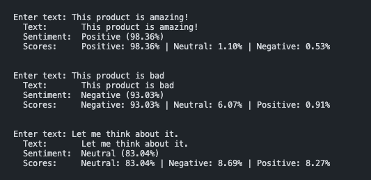

# Sentiment Analysis Tool

[English](README.md) | [中文](README_zh.md)

A local sentiment analysis tool that analyzes text (tweets, product reviews, etc.) and determines if the sentiment is **Positive**, **Negative**, or **Neutral**.

Runs entirely offline — no API tokens required.



## Tech Stack

- **Python** + **Hugging Face Transformers** (RoBERTa model for 3-class sentiment)
- **NLTK VADER** (lightweight rule-based sentiment analyzer)
- **Gradio** (web UI)

## Setup

```bash
# Create virtual environment (recommended)
python -m venv venv
source venv/bin/activate

# Install dependencies
pip install -r requirements.txt
```

## Usage

### CLI - Single text
```bash
python main.py --text "This product is amazing!"
```

### CLI - Batch from file
```bash
python main.py --file texts.txt
```

### CLI - Use VADER engine (lightweight, no model download)
```bash
python main.py --engine vader --text "Terrible experience"
```

### CLI - Interactive mode
```bash
python main.py
```

### Web UI
```bash
python main.py --web
```

## Engines

| Engine | Model | Pros |
|--------|-------|------|
| `transformer` (default) | `cardiffnlp/twitter-roberta-base-sentiment-latest` | Higher accuracy, deep learning based |
| `vader` | NLTK VADER | Fast, no GPU needed, no large model download |
